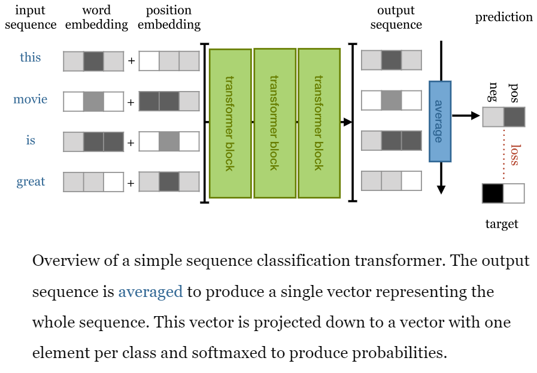

### Problem Description

This code is about AG News classificaton problem. 

AG News (AG's News Corpus) is a subdataset of AG's corpus of news articles constructed by assembling titles and description fields of articles from the 4 largest classes (“World”, “Sports”, “Business”, “Sci/Tech”) of AG's Corpus. The AG News contains 30,000 training and 1,900 test samples per class.

### Model Architecture

### Sample Data 

(3, "Fears for T N pension after talks Unions representing workers at Turner
Newall say they are 'disappointed' after talks with stricken parent firm Federal
Mogul.")

(4, "The Race is On: Second Private Team Sets Launch Date for Human
Spaceflight (SPACE.com) SPACE.com - TORONTO, Canada -- A second\\team of
rocketeers competing for the  #36;10 million Ansari X Prize, a contest
for\\privately funded suborbital space flight, has officially announced
the first\\launch date for its manned rocket.")

### Data pipeline

1- get all text in training set -> tokenize them -> form the vocab dic 

=================================================

    tokenizer = get_tokenizer("basic_english")

    def yield_tokens(data_iter):

        for _, text in data_iter:

            yield tokenizer(text)

    vocab = build_vocab_from_iterator(yield_tokens(train_iter), specials=["<pad>"])

    vocab.set_default_index(vocab["<pad>"])

    print(vocab(['here', 'is', 'an', 'example']))

========================================================================

2- forming the text and lebel pipeline

text_pipeline = lambda x: vocab(tokenizer(x))

label_pipeline = lambda x: int(x) - 1