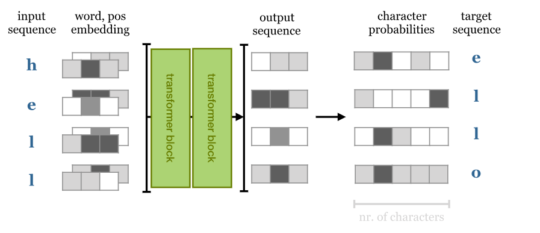

### Prerequisities 

### Problem description
We’ll train a character level transformer to predict the next character in a sequence.

I used the enwiki8 dataset to train the network.   

### Model Architecture



### Data Pipeline
1. This model does not need a tokenizer. I read the file in ASCII format so it assigns a number to each character.

```python
    with gzip.open(path) if path.endswith('.gz') else open(path) as file:
        X = np.frombuffer(file.read(n_train + n_valid + n_test), dtype=np.uint8)
        # X shape : (100_000_000,) list of integers between 0-255
        trX, vaX, teX = np.split(X, [n_train, n_train + n_valid])
```
Train data include 95e6 ASCII code

```python
tensor([ 60, 109, 101,  ...,  47,  47, 119], dtype=torch.uint8)
```

2. Data Batching:     

Takes the data (a single sequence of tokens) and slices out a batch of subsequences to provide as input to the model. For each input instance, it also slices out the sequence that is shofted one position to the right, to provide as a target for the model.

```python
def sample_batch(data, seq_length, batch_size):
    """
    data: The (training) data. A single vector of tokens represented by integers
    length: The length of the subsequences in the batch.
    batch_size: The number of subsequences in the batch
    return: A pair (input, target) of minteger matrices representing the input and target for the model.
    """

    # Sample the starting indices of the sequences to slice out.
    starts = torch.randint(size=(batch_size,), low=0, high=data.size(0) - seq_length - 1)

    # Slice out the input sequences
    seqs_inputs  = [data[start:start + seq_length] for start in starts]
    # -- the start index is the one we just sampled, and the end is exactly 'lentgh' positions after that.
    seqs_target = [data[start + 1:start + seq_length + 1] for start in starts]
    # -- The target is the same sequence as input, except one character ahead (we are asking the model to predict the
    #    next character at each position)

    # We now have two lists of torch vectors, which we can concatenate into matrices of batch_size-by-length
    inputs = torch.cat([s[None, :] for s in seqs_inputs], dim=0).to(torch.long)
    target = torch.cat([s[None, :] for s in seqs_target], dim=0).to(torch.long)
    # -- Note that we add a singleton dimenson to each vector, s[None.,:], and then concatenate along that dimension.

    return inputs, target
```
### Sample Batch

BATCH_SIZE=4, SEQ_LEN=400

```python
(tensor([[110, 105, 116,  ..., 116, 104, 111],
        [ 32, 115, 117,  ...,  97, 109,  32],
        [ 32, 112, 101,  ..., 101, 110, 116],
        [ 32,  71, 101,  ...,  97, 114, 107]]), tensor([[105, 116, 121,  ..., 104, 111, 114],   
        [115, 117,  99,  ..., 109,  32,  83],
        [112, 101, 111,  ..., 110, 116,  32],
        [ 71, 101, 110,  ..., 114, 107, 111]]))
```
