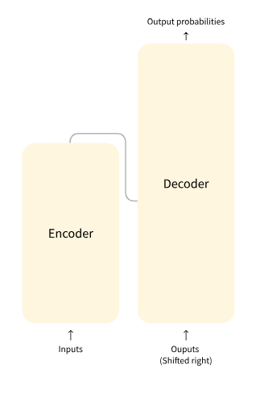

#### how to run the package

install the package first. make sure the current directory is where the setup.py file exists.

```python
pip install -e . 
or
pip setup.py develope
```

In this project template codes for Classification and Generative models are implemented. 

`ClassificationModels` covers the following problems:

    - sequence calssification with transformer (`encoder` model)

`GenerativeModels` cover:

    - Autoregressive (causal) model for text generation (`decoder` moder)
    - Question Answering (`encoder - decoder` model) - IN PROGRESS


### Model High-level Architecture
Here is the 

Encoder (left): The encoder receives an input and builds a representation of it (its features). This means that the model is optimized to acquire understanding from the input. Then we can take this representation and use it for the classification tasks such as sentiment analysis as I did in `ClassificationModels` directory. 

Decoder (right): The decoder uses the encoder’s representation (features) along with other inputs to generate a target sequence. This means that the model is optimized for generating outputs. I used decoder model to implenment causal language modeling in `GenerativeModels` directory. 


